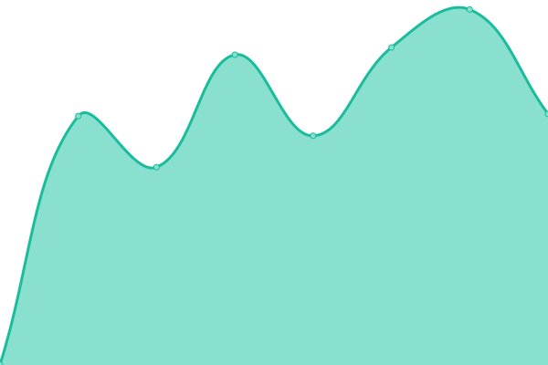

# [📈 Live Status](https://status.yvtils.net): <!--live status--> **🟩 All systems operational**

This repository contains the open-source uptime monitor and status page for [YVtils](https://yvtils.net), powered by [Upptime](https://github.com/upptime/upptime).

With [Upptime](https://upptime.js.org), you can get your own unlimited and free uptime monitor and status page, powered entirely by a GitHub repository. We use [Issues](https://github.com/yvtils/yvtils_status/issues) as incident reports, [Actions](https://github.com/yvtils/yvtils_status/actions) as uptime monitors, and [Pages](https://status.yvtils.net) for the status page.

<!--start: status pages-->
<!-- This summary is generated by Upptime (https://github.com/upptime/upptime) -->
<!-- Do not edit this manually, your changes will be overwritten -->
<!-- prettier-ignore -->
| URL | Status | History | Response Time | Uptime |
| --- | ------ | ------- | ------------- | ------ |
|  [YVtils API](https://api.yvtils.net) | 🟩 Up | [y-vtils-api.yml](https://github.com/YVtils/yvtils_status/commits/HEAD/history/y-vtils-api.yml) | 

 483ms
     
 | 

<a href="https://status.yvtils.net/history/y-vtils-api">100.00%</a>
    

|  [YVtils Panel](https://panel.yvtils.net) | 🟩 Up | [y-vtils-panel.yml](https://github.com/YVtils/yvtils_status/commits/HEAD/history/y-vtils-panel.yml) | 

 695ms
     
 | 

<a href="https://status.yvtils.net/history/y-vtils-panel">100.00%</a>
    

|  [YVtils Web](https://yvtils.net) | 🟩 Up | [y-vtils-web.yml](https://github.com/YVtils/yvtils_status/commits/HEAD/history/y-vtils-web.yml) | 

 395ms
     
 | 

<a href="https://status.yvtils.net/history/y-vtils-web">100.00%</a>
    

<!--end: status pages-->

[**Visit our status website →**](https://status.yvtils.net)

## 📄 License

- Powered by: [Upptime](https://github.com/upptime/upptime)
- Code: [MIT](./LICENSE) © [Anand Chowdhary](https://anandchowdhary.com), supported by [Pabio](https://pabio.com)
- Data in the `./history` directory: [Open Database License](https://opendatacommons.org/licenses/odbl/1-0/)
